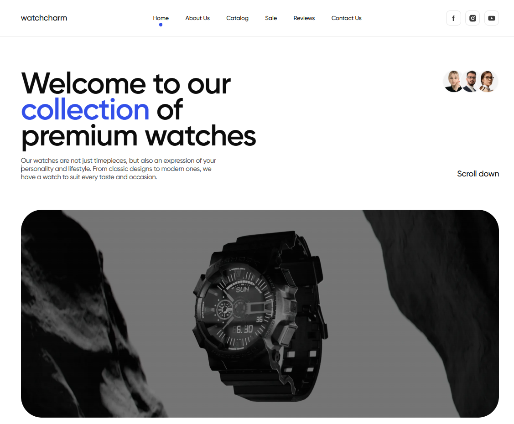

# Watchcharm

A responsive landing page for a premium watch brand built with HTML, CSS,
JavaScript, and Vite. The project showcases products, promotional content,
customer reviews, and a contact section with a modern, mobile-first design.

**Project Screenshot** 

## Live Demo

[Watchcharm](https://developer-mykhailo.github.io/watchcharm/)

## Overview

Style Watch is a responsive promotional website designed to present a luxury
watch collection. The application focuses on clean UI, adaptive layouts, and
interactive user experience across desktop, tablet, and mobile devices.

## Features

- Responsive layout for mobile, tablet, and desktop.
- Mobile navigation menu.
- Product catalog with **Show More / Show Less** functionality.
- Smooth scroll-to-top button.
- Hero, About, Catalog, Sale, Reviews, Advertisement, Contact, and Footer
  sections.
- Optimized images for different screen sizes.
- Built with a modular project structure using Vite partials.

## Tech Stack

- HTML5
- CSS3
- JavaScript (ES6)
- Vite
- PostCSS

## My Role

**Team Lead & Front-end Developer**

### Leadership Responsibilities

- Planned and distributed development tasks across the team.
- Reviewed pull requests and maintained code quality.
- Made architectural and technical decisions.
- Assisted teammates with implementation and debugging.
- Coordinated feature integration and the final project assembly.

### My Contributions

Technical contributions are based on the project's Git history and pull
requests.

- Implemented project features and UI improvements.
- Fixed bugs and refined application behavior.
- Participated in feature integration and overall project maintenance.

## Getting Started

```bash
git clone https://github.com/Developer-Mykhailo/watchcharm.git

cd style-watch

npm install

npm run dev
```

## What I Learned

- Building responsive layouts using a mobile-first approach.
- Organizing a project with reusable HTML partials.
- Implementing interactive UI behavior with vanilla JavaScript.
- Working in a collaborative Git workflow using branches and pull requests.
- Leading a development team, coordinating tasks, reviewing code, and
  integrating team contributions.
